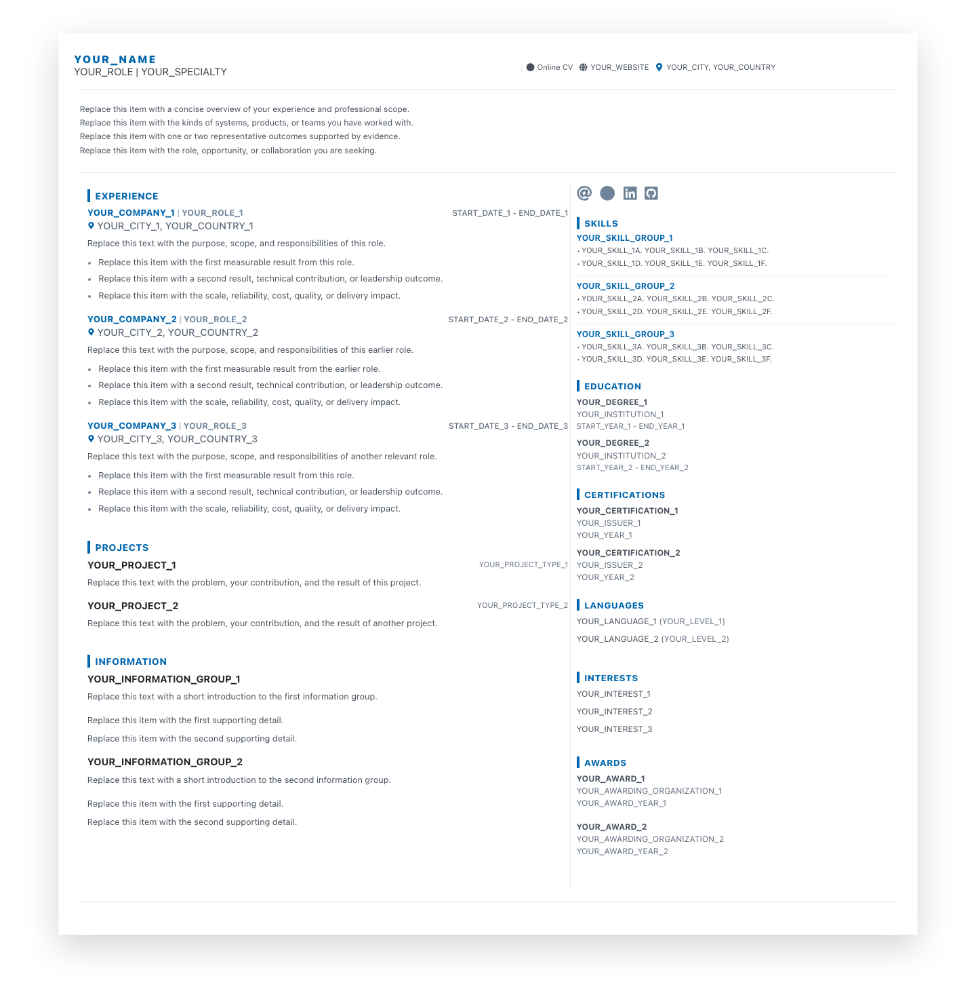
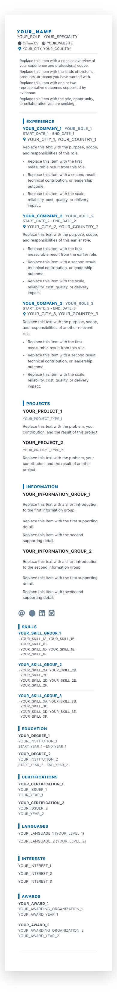

# Publish and deploy cvitals

This repository is a placeholder-only Hugo CV site. It uses the separately published `cvnewtheme` repository as the Git submodule at `themes/cvnewtheme`. Both repositories use the `dev` branch.

Replace every `YOUR_...` value before publishing real content. Keep `params.seo.robots = "noindex, nofollow"` until the final content and production URL are ready.

Choose one repository-visibility workflow: sections 1 and 2 publish public GitHub repositories, while section 3 keeps both GitHub repositories private. Do not run both publication workflows for the same prepared folders.

## Contents

- [Preview](#preview)
- [1. Clone and verify the public repositories](#1-clone-and-verify-the-public-repositories)
- [2. Publish these prepared `/tmp` repositories to GitHub once](#2-publish-these-prepared-tmp-repositories-to-github-once)
- [3. Alternative: use private GitHub repositories and a private theme submodule](#3-alternative-use-private-github-repositories-and-a-private-theme-submodule)
- [4. Add `cvnewtheme` as a submodule to another Hugo site](#4-add-cvnewtheme-as-a-submodule-to-another-hugo-site)
- [5. Replace placeholders and exercise the repeatable layout](#5-replace-placeholders-and-exercise-the-repeatable-layout)
- [6. Build and take desktop and mobile screenshots](#6-build-and-take-desktop-and-mobile-screenshots)
- [7. Deploy public `cvitals` from GitHub to Netlify](#7-deploy-public-cvitals-from-github-to-netlify)
- [8. Publish and consume future theme changes](#8-publish-and-consume-future-theme-changes)
- [9. Troubleshooting](#9-troubleshooting)

## Preview

These checked-in screenshots show the generic repeated fixtures before any personal information is added. Select either image to open it at full resolution.

### Desktop — 1440 × 1200 viewport

<a href="docs/screenshots/cvitals-desktop-1440x1200.png">
  
</a>

### Mobile — 390 × 844 viewport

<a href="docs/screenshots/cvitals-mobile-390x844.png">
  
</a>

## 1. Clone and verify the public repositories

Use this procedure on a fresh machine after both GitHub repositories are public. The destination paths must not already exist.

1. Clone the public `cvitals` repository into `/tmp/cvitals`.

   ```bash
   git clone --branch dev https://github.com/YOUR_GITHUB_ACCOUNT/cvitals.git /tmp/cvitals
   ```

2. Clone the public `cvnewtheme` repository beside it into `/tmp/cvnewtheme`.

   ```bash
   git clone --branch dev https://github.com/YOUR_GITHUB_ACCOUNT/cvnewtheme.git /tmp/cvnewtheme
   ```

   `/tmp/cvnewtheme` is the standalone theme-development checkout. `/tmp/cvitals/themes/cvnewtheme` is a different checkout managed by the site repository as a submodule.

3. Initialize the theme commit pinned by `cvitals`.

   ```bash
   cd /tmp/cvitals
   git submodule sync -- themes/cvnewtheme
   git submodule update --init -- themes/cvnewtheme
   git submodule status -- themes/cvnewtheme
   ```

4. Verify the tracked submodule configuration.

   ```bash
   cd /tmp/cvitals
   git ls-files --stage themes/cvnewtheme
   git config --file .gitmodules --get submodule.themes/cvnewtheme.path
   git config --file .gitmodules --get submodule.themes/cvnewtheme.url
   git config --file .gitmodules --get submodule.themes/cvnewtheme.branch
   ```

   The first command must show Git mode `160000`. The remaining commands must print:

   ```text
   themes/cvnewtheme
   ../cvnewtheme
   dev
   ```

5. Verify that the initialized theme is the exact commit recorded by the site.

   ```bash
   cd /tmp/cvitals
   test "$(git rev-parse HEAD:themes/cvnewtheme)" = "$(git -C themes/cvnewtheme rev-parse HEAD)"
   ```

   Success produces no output. `branch = dev` tells `git submodule update --remote` which branch to follow during an intentional update; builds and Netlify deployments always use the exact gitlink commit recorded by `cvitals`.

## 2. Publish these prepared `/tmp` repositories to GitHub once

Skip this section if the two repositories already exist on GitHub. Publish the theme first so the site never points to an unavailable commit. These commands require the [GitHub CLI](https://cli.github.com/) and create public repositories without adding GitHub-generated files.

1. Authenticate the GitHub CLI and set the account that will own both repositories.

   ```bash
   gh auth login --web --git-protocol https
   gh auth status
   GITHUB_ACCOUNT="YOUR_GITHUB_ACCOUNT"
   ```

2. Confirm that the prepared theme is clean and on `dev`.

   ```bash
   cd /tmp/cvnewtheme
   git switch dev
   test -z "$(git status --porcelain)"
   test -z "$(git remote)"
   ```

3. Create and push the public theme repository, then make `dev` its default branch.

   ```bash
   cd /tmp/cvnewtheme
   gh repo create "$GITHUB_ACCOUNT/cvnewtheme" --public --source=. --remote=origin --push
   gh repo edit "$GITHUB_ACCOUNT/cvnewtheme" --default-branch dev
   test "$(gh repo view "$GITHUB_ACCOUNT/cvnewtheme" --json visibility --jq .visibility)" = "PUBLIC"
   ```

4. Verify that the theme commit pinned by `cvitals` is reachable from the public theme's `dev` branch.

   ```bash
   PINNED_THEME_SHA="$(git -C /tmp/cvitals rev-parse HEAD:themes/cvnewtheme)"
   git -C /tmp/cvnewtheme fetch origin dev
   git -C /tmp/cvnewtheme merge-base --is-ancestor "$PINNED_THEME_SHA" origin/dev
   ```

5. Confirm that the prepared site is clean, uses the portable sibling URL, and is on `dev`.

   ```bash
   cd /tmp/cvitals
   git switch dev
   test -z "$(git status --porcelain)"
   test "$(git config --file .gitmodules --get submodule.themes/cvnewtheme.url)" = "../cvnewtheme"
   test -z "$(git remote)"
   ```

6. Create and push the public site repository, then make `dev` its default branch.

   ```bash
   cd /tmp/cvitals
   gh repo create "$GITHUB_ACCOUNT/cvitals" --public --source=. --remote=origin --push
   gh repo edit "$GITHUB_ACCOUNT/cvitals" --default-branch dev
   test "$(gh repo view "$GITHUB_ACCOUNT/cvitals" --json visibility --jq .visibility)" = "PUBLIC"
   ```

7. Prove that GitHub, rather than a local submodule override, can supply the complete site.

   ```bash
   VERIFY_ROOT="$(mktemp -d /tmp/cvitals-public-verify.XXXXXX)"
   git clone --branch dev "https://github.com/$GITHUB_ACCOUNT/cvnewtheme.git" "$VERIFY_ROOT/cvnewtheme"
   git clone --branch dev --recurse-submodules "https://github.com/$GITHUB_ACCOUNT/cvitals.git" "$VERIFY_ROOT/cvitals"
   git -C "$VERIFY_ROOT/cvitals" submodule status -- themes/cvnewtheme
   test "$(git -C "$VERIFY_ROOT/cvitals" rev-parse HEAD:themes/cvnewtheme)" = "$(git -C "$VERIFY_ROOT/cvitals/themes/cvnewtheme" rev-parse HEAD)"
   RESOLVED_THEME_URL="$(git -C "$VERIFY_ROOT/cvitals/themes/cvnewtheme" remote get-url origin | sed 's/\.git$//')"
   test "$RESOLVED_THEME_URL" = "https://github.com/$GITHUB_ACCOUNT/cvnewtheme"
   hugo --source "$VERIFY_ROOT/cvitals" --gc --minify --cacheDir "$VERIFY_ROOT/cache" --destination "$VERIFY_ROOT/public"
   test -s "$VERIFY_ROOT/public/index.html"
   ```

## 3. Alternative: use private GitHub repositories and a private theme submodule

Use this section instead of sections 1 and 2 when both `cvitals` and `cvnewtheme` must remain private. The private `cvitals` repository is linked to Netlify through the Netlify GitHub App. The separate private `cvnewtheme` repository is fetched during the build through an SSH submodule URL and a read-only deploy key generated by Netlify.

Repository visibility and deployed-site visibility are separate: private GitHub repositories do not automatically make the resulting Netlify website private.

1. Confirm the prerequisites before publishing either repository.

   - You need GitHub permission to create both private repositories and administer deploy keys on `cvnewtheme`.
   - Your local GitHub SSH key must be authorized to read both repositories.
   - If a GitHub organization owns the private `cvitals` repository, confirm that the Netlify team plan supports it. Netlify currently documents that an organization-owned private GitHub repository cannot build on the Core Starter plan.

   ```bash
   gh auth login --web --git-protocol ssh
   gh auth status
   GITHUB_ACCOUNT="YOUR_GITHUB_ACCOUNT"
   SSH_TEST_OUTPUT="$(ssh -T git@github.com 2>&1 || true)"
   printf '%s\n' "$SSH_TEST_OUTPUT"
   printf '%s\n' "$SSH_TEST_OUTPUT" | rg 'successfully authenticated'
   ```

   GitHub normally answers the SSH test with an authenticated greeting and a notice that it does not provide shell access. Capturing the output is intentional because GitHub documents that this successful test exits with status `1`.

2. Publish `cvnewtheme` as a private GitHub repository first.

   ```bash
   cd /tmp/cvnewtheme
   git switch dev
   test -z "$(git status --porcelain)"
   test -z "$(git remote)"
   gh repo create "$GITHUB_ACCOUNT/cvnewtheme" --private --source=. --remote=origin --push
   gh repo edit "$GITHUB_ACCOUNT/cvnewtheme" --default-branch dev
   test "$(gh repo view "$GITHUB_ACCOUNT/cvnewtheme" --json visibility --jq .visibility)" = "PRIVATE"
   ```

3. Change the site from the public relative submodule URL to the private theme's SSH URL, verify the pinned commit, build, and commit the URL change.

   ```bash
   cd /tmp/cvitals
   git switch dev
   test -z "$(git status --porcelain)"
   test -z "$(git remote)"
   git submodule set-url themes/cvnewtheme "git@github.com:$GITHUB_ACCOUNT/cvnewtheme.git"
   git submodule sync -- themes/cvnewtheme
   test "$(git config --file .gitmodules --get submodule.themes/cvnewtheme.url)" = "git@github.com:$GITHUB_ACCOUNT/cvnewtheme.git"
   PINNED_THEME_SHA="$(git rev-parse HEAD:themes/cvnewtheme)"
   git -C themes/cvnewtheme fetch origin dev
   git -C themes/cvnewtheme merge-base --is-ancestor "$PINNED_THEME_SHA" origin/dev
   PRIVATE_BUILD_DIR="$(mktemp -d /tmp/cvitals-private-build.XXXXXX)"
   hugo --gc --minify --cacheDir /tmp/cvitals-hugo-cache --destination "$PRIVATE_BUILD_DIR"
   test -s "$PRIVATE_BUILD_DIR/index.html"
   git add .gitmodules
   git diff --cached --check
   git diff --cached
   git commit -m "Use private cvnewtheme submodule"
   ```

   The tracked `.gitmodules` entry must now contain:

   ```ini
   [submodule "themes/cvnewtheme"]
     path = themes/cvnewtheme
     url = git@github.com:YOUR_GITHUB_ACCOUNT/cvnewtheme.git
     branch = dev
   ```

   Do not put a password, personal access token, private SSH key, or Netlify key in `.gitmodules`.

4. Publish `cvitals` as a private GitHub repository after the SSH submodule URL is committed.

   ```bash
   cd /tmp/cvitals
   test -z "$(git status --porcelain)"
   gh repo create "$GITHUB_ACCOUNT/cvitals" --private --source=. --remote=origin --push
   gh repo edit "$GITHUB_ACCOUNT/cvitals" --default-branch dev
   test "$(gh repo view "$GITHUB_ACCOUNT/cvitals" --json visibility --jq .visibility)" = "PRIVATE"
   ```

5. Prove that a developer with access to both private repositories can clone the site and its private theme through SSH.

   ```bash
   PRIVATE_VERIFY_ROOT="$(mktemp -d /tmp/cvitals-private-verify.XXXXXX)"
   git clone --branch dev --recurse-submodules "git@github.com:$GITHUB_ACCOUNT/cvitals.git" "$PRIVATE_VERIFY_ROOT/cvitals"
   git -C "$PRIVATE_VERIFY_ROOT/cvitals" submodule status -- themes/cvnewtheme
   test "$(git -C "$PRIVATE_VERIFY_ROOT/cvitals" rev-parse HEAD:themes/cvnewtheme)" = "$(git -C "$PRIVATE_VERIFY_ROOT/cvitals/themes/cvnewtheme" rev-parse HEAD)"
   test "$(git -C "$PRIVATE_VERIFY_ROOT/cvitals/themes/cvnewtheme" remote get-url origin)" = "git@github.com:$GITHUB_ACCOUNT/cvnewtheme.git"
   hugo --source "$PRIVATE_VERIFY_ROOT/cvitals" --gc --minify --cacheDir "$PRIVATE_VERIFY_ROOT/cache" --destination "$PRIVATE_VERIFY_ROOT/public"
   test -s "$PRIVATE_VERIFY_ROOT/public/index.html"
   ```

6. Import the private `cvitals` repository into Netlify.

   1. In Netlify, open **Projects**, select **Add new project**, then select **Import an existing project**.
   2. Select **GitHub**. If prompted, install or configure the Netlify GitHub App and grant it access to the private `cvitals` repository.
   3. If `cvitals` is missing from the repository list, select **Configure Netlify on GitHub**, add `cvitals` to the app's repository access, then return to Netlify.
   4. Select the private `cvitals` repository.
   5. Set the production branch to `dev`; leave the base and package directories empty. Confirm build command `hugo --gc --minify --baseURL "$URL"`, publish directory `public`, and `HUGO_VERSION = 0.164.0` from `netlify.toml`.
   6. Select **Deploy site**. The first attempt may fail while cloning the private theme; complete steps 7 and 8 before retrying it.

   The GitHub App authenticates Netlify to the main private `cvitals` repository. Do not add the theme deploy key to `cvitals`; that separate key belongs on `cvnewtheme` only.

7. Generate the private-theme deploy SSH key in Netlify.

   1. Open the new Netlify project's **Project configuration**.
   2. Open **Build & deploy** → **Continuous deployment** → **Deploy key**.
   3. Select **Generate public key**.
   4. Copy the entire displayed public key, including its leading key type such as `ssh-ed25519` or `ssh-rsa`.

   Netlify stores the private half. Copy only the displayed public half to GitHub, and never commit either half to `cvitals` or `cvnewtheme`.

8. Add Netlify's public deploy key to the private `cvnewtheme` repository in GitHub.

   1. Open the private `cvnewtheme` repository on GitHub.
   2. Select **Settings**. Repository administrator access is required.
   3. In the sidebar, select **Deploy keys**.
   4. Select **Add deploy key**.
   5. Enter a descriptive title such as `Netlify cvitals - read only`.
   6. Paste the complete public key copied from Netlify into **Key**.
   7. Leave **Allow write access** unchecked. Netlify only needs read access to clone the pinned theme commit.
   8. Select **Add key** and confirm that the key is listed as read-only.

   A GitHub deploy key belongs to one repository and cannot be reused on another repository. If GitHub reports **Key is already in use**, do not enable write access or attach the key to a user account. Use a fresh Netlify project deploy key for this theme, or remove the old repository association only when it is no longer needed.

9. Retry and verify the private-repository deployment.

   1. Return to the Netlify project's **Deploys** page and retry the failed deploy, or trigger a new deploy from the latest `dev` commit.
   2. Confirm in the deploy log that Netlify checks out the private `cvitals` repository through its GitHub App authorization.
   3. Confirm that `themes/cvnewtheme` clones successfully through `git@github.com:YOUR_GITHUB_ACCOUNT/cvnewtheme.git` without `Permission denied (publickey)` or `Repository not found`.
   4. Confirm that Hugo Extended `0.164.0` builds successfully and Netlify publishes `public`.
   5. Complete sections 5 and 6 for placeholder replacement, local build verification, and local screenshots. Then follow section 7 steps 7 through 12 only for the production URL, robots setting, push, HTTP checks, deployed screenshots, and optional custom domain; do not repeat section 7's public-repository import steps 1 through 6.

10. Preserve and rotate private access safely.

    - Keep the GitHub deploy key read-only and attached only to `cvnewtheme`.
    - Deploy keys do not expire and are not tied to a GitHub user. Remove the GitHub key when the Netlify project is retired.
    - If several Netlify projects consume the same private theme, generate a distinct key in each Netlify project and add each public key separately to `cvnewtheme`.
    - This simple setup assumes that `cvnewtheme` is the Netlify project's only private submodule repository. Netlify exposes one deploy key for the project, while GitHub prohibits reusing one deploy key across repositories. A project with several private submodule repositories needs an approved machine-user, GitHub App, or equivalent multi-repository credential design.
    - Removing the key from GitHub immediately prevents future Netlify builds from cloning the theme.
    - Unlinking the Git repository from the Netlify project deletes Netlify's stored deploy keys and build hooks; generate and install a new key after relinking.
    - GitHub Enterprise organization policy can prohibit deploy keys. An organization owner must change that policy or choose an approved repository-access design before Netlify can clone the private theme.
    - Netlify does not support recursively nested submodules. `cvnewtheme` must not depend on another submodule for this workflow.

## 4. Add `cvnewtheme` as a submodule to another Hugo site

The prepared `cvitals` repository already has this submodule. Use these steps only when adding the public theme to a different site repository.

1. Choose the submodule URL.

   - If `cvitals` and `cvnewtheme` are sibling repository names under the same GitHub owner, use `../cvnewtheme`. Git resolves this relative URL against the site repository's origin.
   - If the repositories have different owners, use `https://github.com/YOUR_THEME_GITHUB_ACCOUNT/cvnewtheme.git`.

2. Add the same-owner theme to `themes/cvnewtheme` and record `dev` as its update branch.

   ```bash
   cd /path/to/site
   git remote -v
   git submodule add --branch dev ../cvnewtheme themes/cvnewtheme
   ```

   For different owners, replace the last command with:

   ```bash
   git submodule add --branch dev https://github.com/YOUR_THEME_GITHUB_ACCOUNT/cvnewtheme.git themes/cvnewtheme
   ```

3. Configure Hugo to use the theme.

   ```toml
   theme = "cvnewtheme"
   ```

4. Commit both the `.gitmodules` file and the exact theme gitlink.

   ```bash
   git add .gitmodules themes/cvnewtheme
   git diff --cached --submodule=log
   git commit -m "Add cvnewtheme as Hugo theme submodule"
   git push origin dev
   ```

5. If ownership changes later, update and commit the URL.

   ```bash
   cd /path/to/site
   git submodule set-url themes/cvnewtheme https://github.com/YOUR_THEME_GITHUB_ACCOUNT/cvnewtheme.git
   git submodule sync -- themes/cvnewtheme
   git add .gitmodules
   git commit -m "Use public cvnewtheme URL"
   git push origin dev
   ```

## 5. Replace placeholders and exercise the repeatable layout

The initial data is deliberately generic and repeated so desktop and mobile screenshots exercise section spacing, wrapping, and column stacking. It contains four summary lines, three experience roles with three result bullets each, two projects, two information groups, three skill groups with two rows each, two education entries, two certifications, two awards, two languages, three interests, two contacts, and two social links.

1. Replace the guiding values in `config.toml`, `static/resume.txt`, and `static/assets/images/avatar.svg`.

   ```bash
   cd /tmp/cvitals
   rg -n 'YOUR_|example\.invalid|Replace this' config.toml static
   ```

2. Preserve at least two entries in each repeated section while customizing. This keeps both responsive screenshots representative instead of showing only empty or single-item states.

3. Keep the site out of search results until every placeholder and temporary URL is gone.

   ```toml
   [params.seo]
   robots = "noindex, nofollow"
   ```

4. Before publishing real content, confirm that the placeholder scan returns no matches and inspect the working-tree changes.

   ```bash
   cd /tmp/cvitals
   rg -n 'YOUR_|example\.invalid|Replace this' config.toml static
   git diff --check
   git diff
   ```

## 6. Build and take desktop and mobile screenshots

The SCSS pipeline requires Hugo Extended `0.164.0`, matching `netlify.toml`.

1. Confirm the local Hugo version and edition.

   ```bash
   hugo version
   hugo version | grep -E 'v0\.164\.0.*extended'
   ```

2. Build the site with the pinned theme into a temporary directory outside the repository.

   ```bash
   cd /tmp/cvitals
   BUILD_DIR="$(mktemp -d /tmp/cvitals-build.XXXXXX)"
   hugo --gc --minify --cacheDir /tmp/cvitals-hugo-cache --destination "$BUILD_DIR"
   test -s "$BUILD_DIR/index.html"
   ```

3. Capture deterministic full-page desktop and mobile screenshots with Playwright. The images and server log remain outside the Git repository.

   ```bash
   PLAYWRIGHT_VERSION="1.61.1"
   SCREENSHOT_DIR="$(mktemp -d /tmp/cvitals-screenshots.XXXXXX)"
   cd /tmp/cvitals
   hugo server --bind 127.0.0.1 --port 1313 --disableFastRender >"$SCREENSHOT_DIR/hugo.log" 2>&1 &
   HUGO_PID=$!
   trap 'kill "$HUGO_PID" 2>/dev/null || true' EXIT INT TERM
   ATTEMPT=0
   until curl -fsS http://127.0.0.1:1313/ >/dev/null; do
     ATTEMPT=$((ATTEMPT + 1))
     if [ "$ATTEMPT" -ge 80 ] || ! kill -0 "$HUGO_PID" 2>/dev/null; then
       cat "$SCREENSHOT_DIR/hugo.log"
       exit 1
     fi
     sleep 0.25
   done
   npx --yes "playwright@$PLAYWRIGHT_VERSION" install chromium
   npx --yes "playwright@$PLAYWRIGHT_VERSION" screenshot --browser chromium --viewport-size "1440,1200" --full-page --wait-for-timeout 1000 http://127.0.0.1:1313/ "$SCREENSHOT_DIR/cvitals-desktop-1440x1200.png"
   npx --yes "playwright@$PLAYWRIGHT_VERSION" screenshot --browser chromium --viewport-size "390,844" --full-page --wait-for-timeout 1000 http://127.0.0.1:1313/ "$SCREENSHOT_DIR/cvitals-mobile-390x844.png"
   test -s "$SCREENSHOT_DIR/cvitals-desktop-1440x1200.png"
   test -s "$SCREENSHOT_DIR/cvitals-mobile-390x844.png"
   kill "$HUGO_PID"
   trap - EXIT INT TERM
   printf '%s\n' "$SCREENSHOT_DIR"
   ```

4. Inspect both images. The desktop image must show the main/sidebar layout; the `390`-pixel mobile image must show stacked content without horizontal clipping. Confirm that all repeated entries appear in both.

5. If Node.js is unavailable, run `hugo server --bind 127.0.0.1 --port 1313`, open `http://127.0.0.1:1313/` in Chrome, open Developer Tools, toggle the device toolbar, select **Responsive**, enter `1440 × 1200` and then `390 × 844`, and use the command menu's **Capture full size screenshot** command at each size.

## 7. Deploy public `cvitals` from GitHub to Netlify

Netlify clones the site repository and its public theme submodule, runs Hugo, publishes the generated `public` directory, and rebuilds whenever `dev` receives a new site commit.

1. Confirm on GitHub that both repositories are **Public**, both default to `dev`, and the site repository shows `themes/cvnewtheme` at a theme commit that exists on the public theme's `dev` branch.

2. Sign in to Netlify and open **Projects**.

3. Select **Add new project**, then **Import an existing project**.

4. Choose **GitHub**, authorize Netlify if prompted, and select the public `cvitals` repository—not the standalone `cvnewtheme` repository.

5. Confirm the deployment settings before selecting **Deploy site** or **Publish**:

   - Production branch: `dev`
   - Base directory: empty
   - Package directory: empty
   - Build command: `hugo --gc --minify --baseURL "$URL"`
   - Publish directory: `public`
   - Environment variable: `HUGO_VERSION = 0.164.0`

   The committed root `netlify.toml` is the source of truth for the build command, publish directory, deploy-preview commands, branch-deploy commands, and Hugo version.

6. Start the first deployment. In its log, confirm that Netlify checks out the public `themes/cvnewtheme` submodule, installs Hugo Extended `0.164.0`, completes the Hugo build, and publishes `public`.

7. Open the assigned `https://YOUR_NETLIFY_SITE.netlify.app/` URL and inspect the complete page.

8. Update both production URL fields in `config.toml` to the assigned Netlify URL or final custom domain.

   ```toml
   baseURL = "https://YOUR_NETLIFY_SITE.netlify.app/"

   [params.seo]
   canonical = "https://YOUR_NETLIFY_SITE.netlify.app/"
   robots = "index, follow"
   ```

9. Commit and push the final URLs and search setting. This push triggers a second Netlify production deployment.

   ```bash
   cd /tmp/cvitals
   rg -n 'YOUR_|example\.invalid|Replace this' config.toml static
   git add config.toml static
   git diff --cached --check
   git diff --cached
   git commit -m "Configure production CV site"
   git push origin dev
   ```

10. Wait for the production deployment to finish, then verify the public response and rendered metadata.

    ```bash
    SITE_URL="https://YOUR_NETLIFY_SITE.netlify.app/"
    curl --fail --location "$SITE_URL" >/dev/null
    curl --fail --silent --location "$SITE_URL" | rg 'canonical|index, follow'
    ```

11. Capture self-contained full-page screenshots of the deployed URL and keep them as deployment evidence.

    ```bash
    SITE_URL="https://YOUR_NETLIFY_SITE.netlify.app/"
    PLAYWRIGHT_VERSION="1.61.1"
    DEPLOY_SCREENSHOT_DIR="$(mktemp -d /tmp/cvitals-deploy-screenshots.XXXXXX)"
    npx --yes "playwright@$PLAYWRIGHT_VERSION" install chromium
    npx --yes "playwright@$PLAYWRIGHT_VERSION" screenshot --browser chromium --viewport-size "1440,1200" --full-page --wait-for-timeout 1000 "$SITE_URL" "$DEPLOY_SCREENSHOT_DIR/cvitals-desktop-1440x1200.png"
    npx --yes "playwright@$PLAYWRIGHT_VERSION" screenshot --browser chromium --viewport-size "390,844" --full-page --wait-for-timeout 1000 "$SITE_URL" "$DEPLOY_SCREENSHOT_DIR/cvitals-mobile-390x844.png"
    test -s "$DEPLOY_SCREENSHOT_DIR/cvitals-desktop-1440x1200.png"
    test -s "$DEPLOY_SCREENSHOT_DIR/cvitals-mobile-390x844.png"
    printf '%s\n' "$DEPLOY_SCREENSHOT_DIR"
    ```

12. To use a custom domain, open the Netlify project's **Domain management**, add the production domain, complete the displayed DNS instructions, then repeat steps 8 through 11 with the custom HTTPS URL.

## 8. Publish and consume future theme changes

The standalone theme must be tested and pushed before the site records its new commit. Never force-push or delete published theme history while a deployed site may still pin one of its commits.

1. Update, edit, test, commit, and push the standalone theme.

   ```bash
   cd /tmp/cvnewtheme
   git switch dev
   git pull --ff-only origin dev
   # Edit theme files, then continue.
   git add -A
   git diff --cached --check
   git diff --cached
   THEME_BUILD_DIR="$(mktemp -d /tmp/cvnewtheme-build.XXXXXX)"
   HUGO_RESOURCEDIR="$THEME_BUILD_DIR/resources" hugo --source exampleSite --themesDir ../.. --theme cvnewtheme --gc --minify --cacheDir /tmp/cvnewtheme-hugo-cache --destination "$THEME_BUILD_DIR/public"
   test -s "$THEME_BUILD_DIR/public/index.html"
   git commit -m "Describe theme change"
   git push origin dev
   NEW_THEME_SHA="$(git rev-parse HEAD)"
   ```

2. Update the site checkout to the new `dev` commit, rebuild, and record the new gitlink. The same commands work with either the public URL from section 2 or the private SSH URL from section 3.

   ```bash
   cd /tmp/cvitals
   NEW_THEME_SHA="$(git -C /tmp/cvnewtheme rev-parse HEAD)"
   git submodule sync -- themes/cvnewtheme
   git submodule update --remote --checkout themes/cvnewtheme
   test "$(git -C themes/cvnewtheme rev-parse HEAD)" = "$NEW_THEME_SHA"
   BUILD_DIR="$(mktemp -d /tmp/cvitals-build.XXXXXX)"
   hugo --gc --minify --cacheDir /tmp/cvitals-hugo-cache --destination "$BUILD_DIR"
   test -s "$BUILD_DIR/index.html"
   git add themes/cvnewtheme
   git diff --cached --submodule=log
   git commit -m "Update cvnewtheme theme revision"
   git push origin dev
   ```

3. Confirm the Netlify deployment uses the new site commit and its newly pinned theme SHA. Pushing only `cvnewtheme` cannot change the site deployment.

## 9. Troubleshooting

1. If Netlify cannot find `cvnewtheme`, verify that the theme repository is public. For same-owner sibling repositories, `.gitmodules` should contain `../cvnewtheme`; for different owners, use its full public HTTPS URL.

   For a private theme, `.gitmodules` must instead use `git@github.com:YOUR_GITHUB_ACCOUNT/cvnewtheme.git`. Confirm that the current Netlify project's public deploy key is installed as a read-only GitHub deploy key on that private theme repository.

2. Resynchronize a corrected URL and initialize the submodule again.

   ```bash
   cd /tmp/cvitals
   git submodule sync -- themes/cvnewtheme
   git submodule update --init -- themes/cvnewtheme
   ```

3. If a build reports an SCSS or Hugo-edition error, confirm that `hugo version` says `extended` and that `netlify.toml` pins `HUGO_VERSION = "0.164.0"`. Clear Netlify's build cache and retry only after correcting the configuration.

4. If Netlify renders an older theme, compare the deployed site's gitlink with the local submodule commit.

   ```bash
   cd /tmp/cvitals
   git rev-parse HEAD:themes/cvnewtheme
   git -C themes/cvnewtheme rev-parse HEAD
   ```

5. Consult the current official documentation when the provider UI or build requirements change:

   - [Import a repository into Netlify](https://docs.netlify.com/manage/projects/add-new-project/)
   - [Netlify repository, GitHub App, private submodule, and deploy-key access](https://docs.netlify.com/build/git-workflows/repo-permissions-linking/)
   - [Netlify private repository build-access support guide](https://answers.netlify.com/t/support-guide-how-do-i-access-private-repositories-in-the-build-environment/723)
   - [GitHub deploy keys](https://docs.github.com/en/authentication/connecting-to-github-with-ssh/managing-deploy-keys)
   - [GitHub SSH connection test](https://docs.github.com/en/authentication/connecting-to-github-with-ssh/testing-your-ssh-connection)
   - [Netlify organization-owned private repository limitation](https://docs.netlify.com/build/configure-builds/troubleshooting-tips/#organization-owned-private-repository)
   - [Hugo's Netlify deployment guide](https://gohugo.io/host-and-deploy/host-on-netlify/)
   - [Git `.gitmodules` configuration](https://git-scm.com/docs/gitmodules.html)
   - [Git submodule commands](https://git-scm.com/docs/git-submodule.html)
   - [GitHub CLI repository creation](https://cli.github.com/manual/gh_repo_create)
   - [Playwright screenshots](https://playwright.dev/docs/screenshots)
